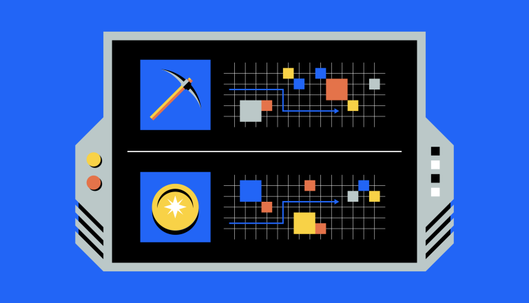
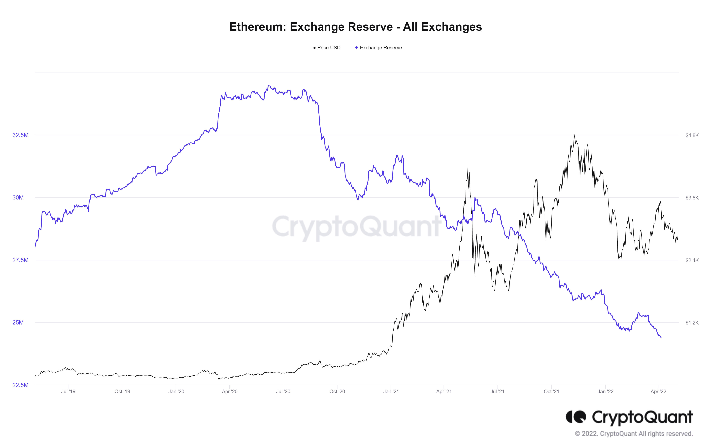
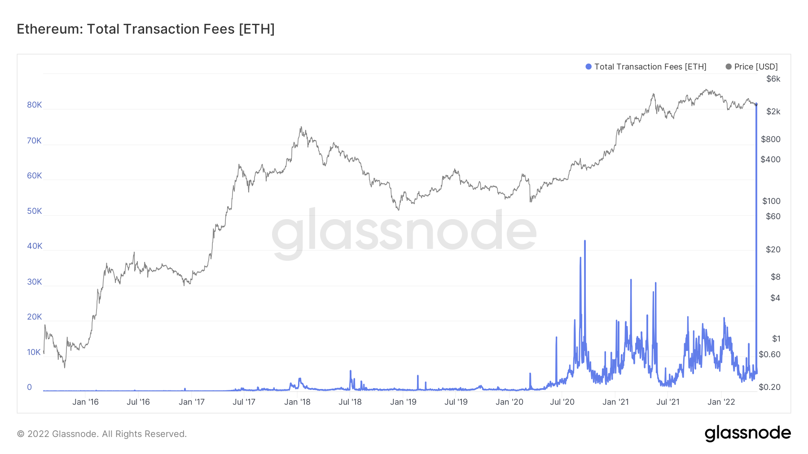

> Ethereum is moving towards being secured by ETH, not computing power.
> "A truly exciting step in realizing the [Ethereum vision](https://ethereum.org/en/upgrades/vision/) – more scalability, security, and sustainability."  
> [The Merge | ethereum.org](https://ethereum.org/en/upgrades/merge/)

### Eco-friendly Ethereum

One of the key features of blockchain technology is its decentralised nature and ability to achieve network consensus without a third party intermediary. The two most prominent consensus mechanisms are [proof-of-work](https://www.investopedia.com/terms/p/proof-work.asp#:~:text=Key%20Takeaways,transactions%20and%20mining%20new%20tokens) (PoW), often referred to as mining, and [proof-of-stake](https://www.investopedia.com/terms/p/proof-stake-pos.asp#:~:text=Proof%2Dof%2DWork%3F,new%20blocks%20to%20the%20blockchain) (PoS) which involves network participants staking their capital to help secure the network.

The merge, previously known as Eth2, is a long awaited upgrade to the Ethereum blockchain that will combine the [Beacon Chain](https://ethereum.org/en/upgrades/beacon-chain/) with their [Mainnet](https://ethereum.org/en/glossary/#mainnet). The merge has been in the works for several years and although it has been postponed due to development delays, it is tentatively due to be released late 2022. This switch from a PoW to a PoS model aims to minimise energy consumption while improving the efficiency of the network.

### An investor's perspective

As the second largest cryptocurrency by [marketcap](https://coinmarketcap.com/currencies/ethereum/), boasting over [3000 dApps](https://www.coindesk.com/learn/2021/02/08/which-crypto-projects-are-based-on-ethereum/#:~:text=According%20to%20the%20crypto%20app,running%20on%20the%20Ethereum%20blockchain.) built on its blockchain, we know that Ethereum acts as a key foundational layer for the growth and development of much of the blockchain ecosystem. 

So the question is, what does the merge mean for your investment?  To help better understand the potential price response to the merge let's take a look at the on-chain data. 

**Supply and demand**

As displayed above, the amount of Ethereum available for purchase on cryptocurrency exchanges has been declining since late 2020 and is currently at all time lows. This shows that many investors are willing to hold their ETH long term, choosing to withdraw their coins from exchanges rather than sell at current market price.

**Bulls vs bears**

As is often the case in cryptocurrency investing, the merge and its potential impact on ETH price could be polarising. 

Many expect that the convergence of the Beacon Chain and Mainnet will see an increase in demand for ETH as developers build upon the improved blockchain network, while traders seek to capitalise on these developments, driving prices up.

On the contrary, it could be argued that the upgrades to the Ethereum blockchain are already priced in to the current market valuation. With the merge having been in development for a long period of time, large corporations have had time to consider their positions and strategise. 

This opens up the potential for large players to use the merge as an exit liquidity trade, oversaturating exchanges with ETH and causing a drop in price.

### Enter incentivised staking

Blockchain revenue is generated through transaction fees, in the case of Ethereum these fees are known as [gas](https://ethereum.org/en/developers/docs/gas/). Whether you're buying and selling NFTs, trading on DeFi exchanges or using P2E Games, every transaction on the Ethereum blockchain is paid for via a gas fee. 

The table below shows how quickly these fees add up. During the recent [Yuga Labs](https://twitter.com/yugalabs) [OthersideMeta](https://twitter.com/OthersideMeta) listing, network participants were paying upward of $2,000 per transaction just to use the Ethereum blockchain and mint their NFT land plots. This resulted in gas transaction fees of over $200,000,000 USD (80,000 ETH).

 

The current PoW consensus incentivises miners, dividing up gas fees and distributing them to network participants as a reward for their efforts. This is great for those who have the minimum required 32 ETH on hand and are able to afford the expensive hardware and graphics cards to run their operations.

The merge upgrade will throw away this mining model, lowering the barrier to entry for ETH holders who will be able to stake their coins and receive rewards for their efforts in helping to secure the network. 

However these changes come at a cost. With a lower barrier to entry, more participants are expected to stake their ETH coins resulting in a lower projected APR. There are tools available that will help you gauge your potential [staking rewards](https://www.stakingrewards.com/earn/ethereum-2-0/) as a [validator](https://ethereum.org/en/developers/docs/consensus-mechanisms/pos/#pos-staking-validators), or through [staking pools](https://ethereum.org/en/staking/pools/#main-content) such as [Stake Wise](https://stakewise.io/) or [Lido Finance](https://lido.fi/ethereum). Current returns are between 4-7% APR.

 For those without time to worry about staking pools or validator nodes, there are simpler alternatives. With platforms such as [Celsius](https://celsius.network/) you can lock up your crypto at up to 6% APR and let them deal with the tricky stuff!

### Summary

The merge is one of the most anticipated events in the history of blockchain and decentralised technologies. Whether you're a long-term HODLer or a speculative investor watching from afar, all eyes will be on Ethereum!

 

